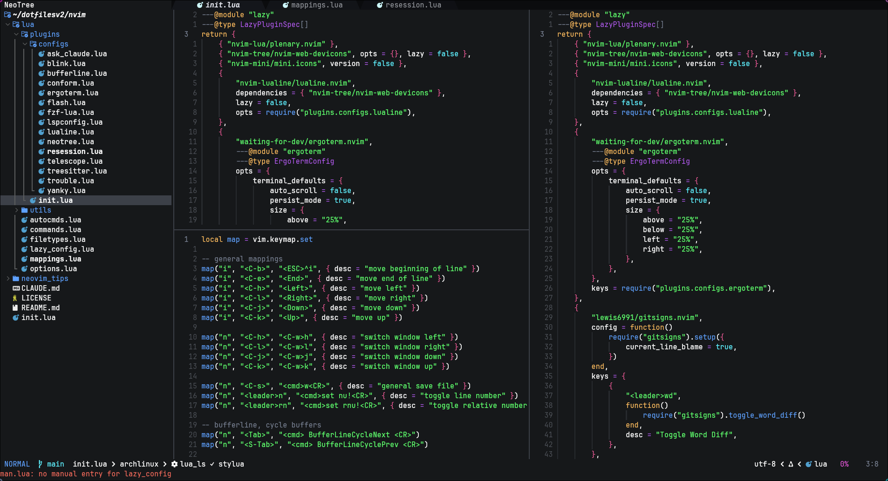

# NotSoTinyVim



# Install

- Linux or MacOS

```bash
git clone https://github.com/TeomanM/tinyvim ~/.config/nvim && nvim
```

Run `:MasonInstallAll` command after lazy.nvim finishes downloading plugins

- Windows

```bash
git clone https://github.com/TeomanM/tinyvim $HOME\AppData\Local\nvim --depth 1 && nvim
```

Run `:MasonInstallAll` command after lazy.nvim finishes downloading plugins

# Reset

```bash
rm -rf ~/.local/share/nvim && rm -rf ~/.config/nvim/lazy-lock.json
```

# Dir structure

```bash
├── init.lua
├── lua
│   ├── autocmds.lua
│   ├── commands.lua
│   ├── filetypes.lua
│   ├── lazy_config.lua
│   ├── mappings.lua
│   ├── options.lua
│   ├── plugins
│   │   ├── init.lua
│   │   └── configs
│   │       ├── ask_claude.lua
│   │       ├── blink.lua
│   │       ├── bufferline.lua
│   │       ├── conform.lua
│   │       ├── ergoterm.lua
│   │       ├── flash.lua
│   │       ├── fzf-lua.lua
│   │       ├── lspconfig.lua
│   │       ├── lualine.lua
│   │       ├── neotree.lua
│   │       ├── resession.lua
│   │       ├── telescope.lua
│   │       ├── treesitter.lua
│   │       ├── trouble.lua
│   │       └── yanky.lua
│   └── utils
│       ├── resession_picker.lua
│       └── term_utils.lua
└── neovim_tips
```

# Important Plugins used

| Name                          | Description                                           |
| ----------------------------- | ----------------------------------------------------- |
| neo-tree.nvim                 | File tree                                             |
| nvim-web-devicons / mini.icons | Icons                                                |
| nvim-treesitter               | Syntax tree, highlighting, incremental selection      |
| bufferline.nvim + scope.nvim  | Bufferline with per-tab buffer lists                  |
| lualine.nvim                  | Statusline                                            |
| blink.cmp                     | Autocompletion                                        |
| LuaSnip & friendly-snippets   | Snippets                                              |
| nvim-lspconfig + mason.nvim   | LSP configuration and binary management               |
| conform.nvim                  | Formatter (oxfmt for web, stylua for Lua)             |
| trouble.nvim                  | Diagnostics, quickfix, and LSP results list           |
| gitsigns.nvim + neogit        | Git decorations and full Git UI                       |
| telescope.nvim + fzf-lua      | Fuzzy finder                                          |
| flash.nvim                    | Fast motions and search                               |
| grug-far.nvim                 | Project-wide search and replace                       |
| yanky.nvim                    | Yank history and ring                                 |
| resession.nvim                | Session management (auto-save per cwd + git branch)   |
| ergoterm.nvim                 | Terminal management                                   |
| rustaceanvim                  | Rust LSP (bypasses mason-lspconfig)                   |
| which-key.nvim                | Keymap hints                                          |
